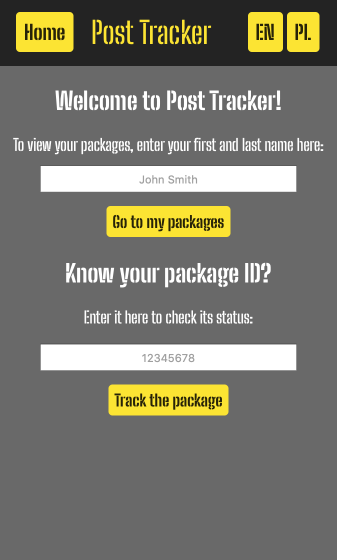
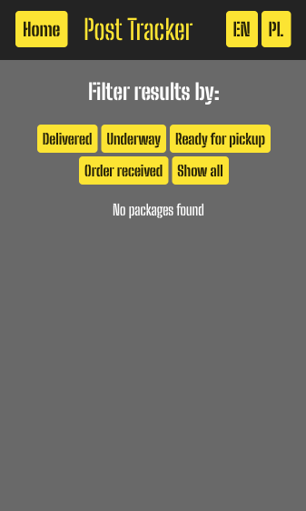
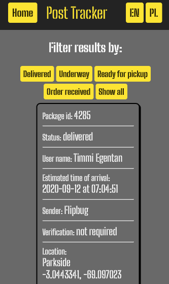
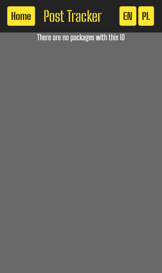
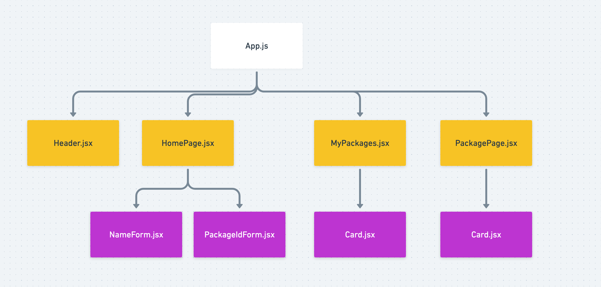

# SDA Package Tracker

This project was bootstrapped with [Create React App](https://github.com/facebook/create-react-app).

## Available Scripts

In the project directory, you can run:

### `npm start`

Runs the app in the development mode.\
Open [http://localhost:3000](http://localhost:3000) to view it in the browser.

The page will reload if you make edits.\
You will also see any lint errors in the console.

## Tutorial

### Important note

The app is using the data from the src/orders.json file.
DO NOT DELETE THE FILE. 
If you want to test the application with another json file, make sure to replace the orders.json
with a new orders.json file with the same data format.

### Home Page
After opening the app, the following screen appears:

Button Home serves as a navigation button, that always directs you to the main page.

Buttons EN and PL are to switch between English and Polish language. If you do not press any of these
buttons, the page will display in English by default.

If you wish to view all packages assigned to your name, enter your name in the first field and click
'Go to my packages'. You will not be able to click the button if you leave the field empty.

In case you want to search the package by its ID, type in the ID of the package in the second field
and click 'Track the package'. Similarly to the previous field, you only will be able to click the button
if you provide the ID in the field.

These two fields and buttons are independent, you can use one or the other.

### My Packages page

If you decided to view all your packages by typing your name in the first field there are two options.

1. If you have some packages assigned to your name, you will see the following screen:

2. If there are no packages waiting for you, the following screen with packages will appear:

If you wish to go back to the home page, you can always click the 'Home' button in the header.

### Package Page

If you chose to track your package by ID, the following screen will appear:

In this case, there are no results matching to the id, however you will see
the package with the given id if the match is found in the database.

### Components diagram

